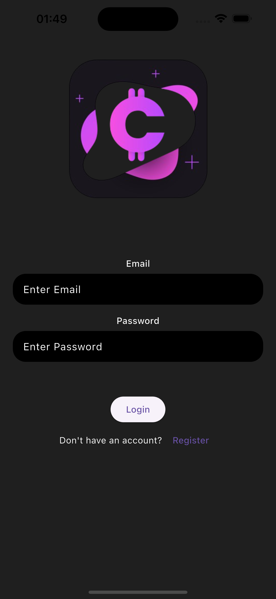
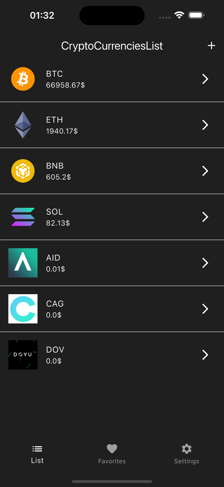
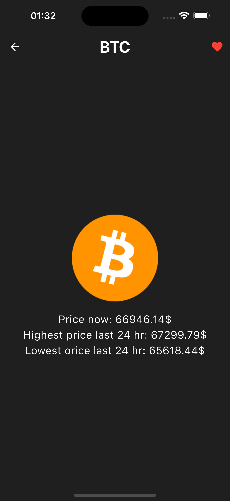
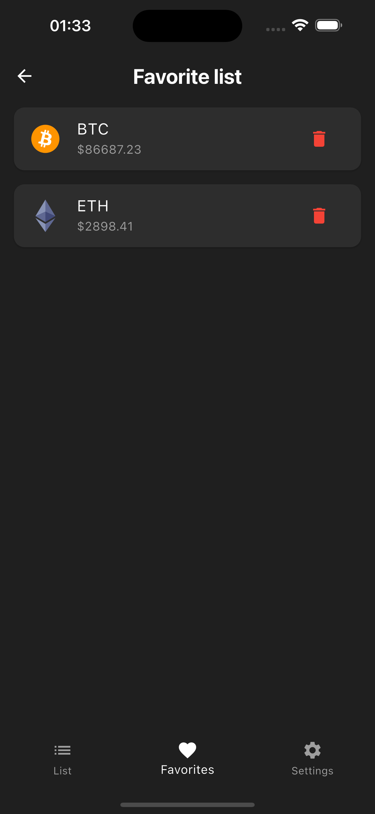
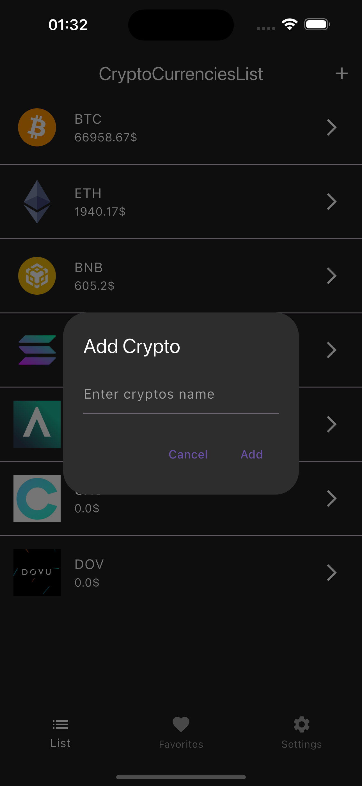

# ToDo List App (Flutter + BLoC)

A cross-platform mobile application built with Flutter.
The app allows users to manage tasks efficiently with clean architecture using BLoC state management.

## 🚀 Features
- Add and delete tasks
- Mark tasks as completed
- State management using BLoC
- Clean and structured project architecture
- Responsive UI

## 🧠 Architecture

This project follows the BLoC (Business Logic Component) pattern.
UI is separated from business logic to ensure scalability and maintainability.

UI → Event → BLoC → State → UI

## 🛠 Tech Stack
- Flutter
- Dart
- flutter_bloc
- Git

## 🖼 Screenshots

## ⚙️ How to run

git clone https://github.com/RYUU05/ToDo_list_2.git
cd ToDo_list_2
flutter pub get
flutter run

This project was created as part of my Flutter learning journey.